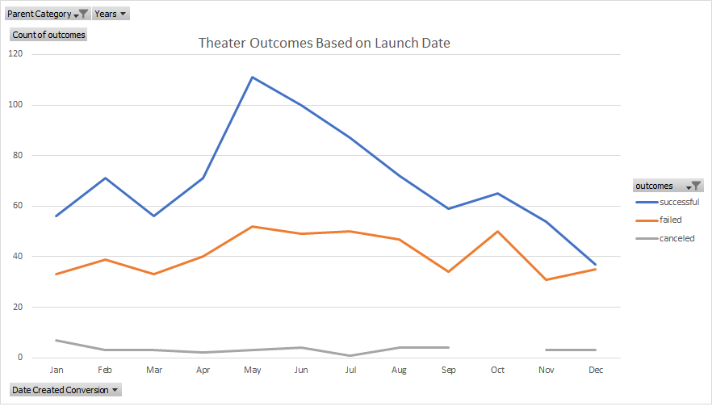
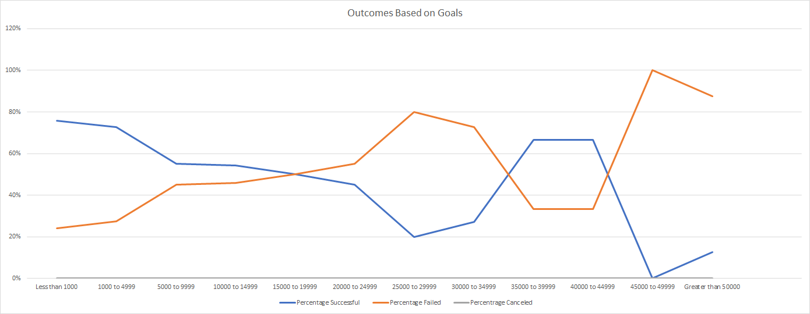
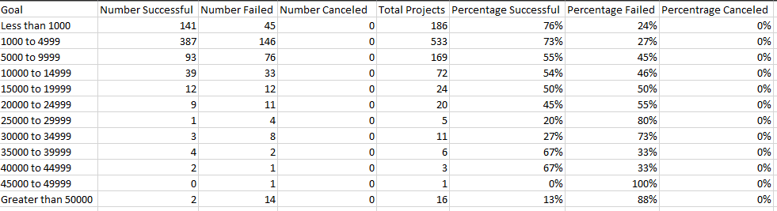

# Kickstarter Analysis
## Project Overview and Purpose
This project was meant to investigate data from Kickstarter campaigns to find trends to determine if there are factors that can help a campaign's successful funding.
For my purposes, I was helping someone that wanted to successfully obtain funding to perform the play _Fever_, a one-man show theatrical production.
The fact that they were starting a Kickstarter for a play helped narrow the focus of my analysis to find successful and unsuccessful trends for theater/play Kickstarters.
With the provided data I was able to find certain treads and recommend approaches that, when followed, would suggest a higher likelihood of obtaining full funding for the production. Within the workbook, I generated separate sheets with data that breaks down and visualizes category and subcategory statistics, outcomes based on launch date, and outcomes based on funding goals. The findings and conclusions from these are highlighted in the Results section below.

## Analysis and Challenges
The data consisted of 4115 Kickstarters between the years of 2009 to 2017. The data included information from successful and failed Kickstarters from a large variety of categories including... 
*	Film and Video
*	Food
*	Games
*	Journalism
*	Music
*	Photography
*	Publishing
*	Technology
*	Theater
	
Within the workbook I generated separate sheets with data that breaks down and visualizes...
*	Category and Subcategory Statistics
*	Outcomes based on launch date
*	Outcomes based on funding goals
			
To begin my analysis of the data I first looked at the overall workbook to get an idea of the data that had been pull for me.
Since my analysis was for the purpose of helping with a play, I generated more columns to be able to filter down to the parent categories (listed above) and subcategories. For example, the parent category would be **Theater** and the subcategory **Plays**.

From there I was able to gather statistics and visualize trends.

### Analysis of Outcomes Based on Launch Date

I began by putting together the data to show if the campaign's specific start date affected success by months. I did this via a pivot table filtering for parent category and years with the rows the months of the year and columns the outcomes (successful, failed, etc.). 

This graph was the product.

### Analysis of Outcomes Based on Goals

Next, I put together the data to show if a higher funding goal affected success. The formulas used to gather the data for outcomes based on goals looked something like this...

`=COUNTIFS(Kickstarter!$F:$F,"successful",Kickstarter!$D:$D,">=1000",Kickstarter!$D:$D,"<4999",Kickstarter!$R:$R,"plays")` 

This formula, and the others like it in the Outcomes Based on Goals sheet, were used to collect and separate the number of campaigns that were or were not successful and the funding goal.
This particular sting is being used to count the number of play campaigns that were successful with funding goals between $1000 and $4999. 

This graph was the product.

This table has been added after the fact due to poor representation of the data in the graph (See Limitations section).

### Challenges and Difficulties Encountered

There were a handful of challenges that required a few extra steps/efforts to overcome. 
*	Some relevant data needed to be converted/altered into readable formats. For example, the raw data for dates were in Unix timestamps, which required converting. I did this using this formula `=(((J2/60)/60)/24)+DATE(1970,1,1)` which converts the Unix timestamp, `J2`, to the mm/dd/yyyy format. 
*	At one point I thought my data had been corrupted because I was unable to scroll or build new pivot tables. Thankfully I was able to troubleshoot and resolve the issue 	and it turned out to be that the "freeze panes" option had prevented me from using the data. Easy fixes are always nice!

## RESULTS
### Theater Outcomes by Launch Date		

Conclusions from the theater outcomes when focusing on when to launch the campaign (see corresponding line chart)
*	The data shows that there is an increase in success rate of campaigns that begin in the month of May.
	*	Late April to early May would be the best time to launch any theater related Kickstarters.
*	The data shows that the chance of success steadily decreases through the rest of the year with December being the worst time to launch a campaign
	*	Ideally, the latest to begin a theater-based Kickstarter campaign would be July.
	
Based on these findings, the time of year to ensure the greatest chance of success would be early to mid-summer. 
	
### Outcomes Based on Goals

Conclusion from the outcomes of Kickstarter campaigns for plays when focused on funding goals (see corresponding line chart)
*	There are few plays that are successfully funded that have funding goals greater than $5000
	*	The percentage of successful campaigns drops approximately 25% when the funding goal is greater than $5000

Based on this finding, the ideal funding goal is less than $5000	

## Limitations

*	The graph for Outcomes Based on Goals does **NOT** include the number of campaigns for each goal range. A closer look at the graph could lead to the conclusion that Kickstarters with goals between $35000 to $45000 are just as likely to be funded as those below $5000. This graph in its current form is very susceptible to outliers.
	*	I have added an image of the raw data table to show the distribution more accurately.
*	More investigation into the specific successful and failed campaigns marketing could be of great use.
	If possible, data for marketing strategies, calls to action, and breakdowns of backer benefits could generate very valuable data for how to have a 		successful Kickstarter campaign.
*	Since this specific play _Fever_ is a one-man show production, it would have been more beneficial to analyze other Kickstarters that were for other one-man 		shows.
	When sifting through the data, only six of the play campaigns were also one-man shows (according to the **Blurb** column when searching for "One-Man"). 
	The ability to perform analysis on more one-man shows could show specifically what factors matter most for successful funding of that type of theater 		production.
	*	Note: all One-Man shows in the data were successfully funded and had funding goals less than or equal to $5000, which supports part of our 			conclusions.
*	While there was a large amount of data to work with, there could always be more. More data would help to get more accurate results/findings.
	According to [Kickstarter.com's stats page](https://www.kickstarter.com/help/stats), there have been nearly 214,000 successfully funded campaigns 		while the raw data in my analysis only covers 4115. 
		Of course, analysis of all these campaigns is not necessary, but more data is always going to help improve the accuracy of the results.			
							
